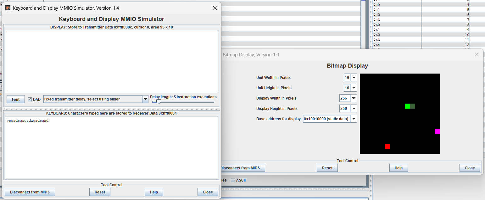
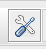

# Jeu snake en MIPS32

Bienvenue voici le projet Jeu snake réalisé en langage d'assembleur MIPS32. Ce projet est une version du jeu snake qu'on a tous déjà joué un jour, développé dans le cadre d'un projet de ma formation.
## Sommaire

<ul>
    <li><a href="#introduction">Introduction</a></li>
    <li><a href="#fonctionnalités">Fonctionnalités</a></li>
    <li><a href="#conditions-dexécution">Conditions d'exécution</a></li>
    <li><a href="#installation">Installation</a></li>
    <li><a href="#utilisation">Utilisation</a></li>
</ul>


## Introduction


<p>
  Ce projet est un implémentation du jeu Snake en utilisant MIPS32 langage assembleur. Le jeu est conçu pour fonctionner sur un simulateur MIPS32 et nous permet de comprendre les principes de la programmation assembleur.
    
</p>

## Fonctionnalités

- Règles classique du snake
- Mouvements du snake
- À chaque fois que snake mange on ajoute un obstacle à une position random
- Affichage dans la console le score final

## Conditions d'exécution

Pour executer ce projet, vous aurez besoins :

- IDE MARS MIPS32
- Le fichier <a href="snake.asm">`snake.asm`</a>

## Installation

1. Clonez le répertoire sur votre machine:

    ```sh
    git clone git@github.com:amine-benomar6/snake_mips32.git
    ```

2. Allez sur le répertoire du projet:

    ```sh
    cd snake_mips32
    ```

3. Ouvrez le fichier <a href="snake.asm">`snake.asm`</a> avec l'IDE MIPS32 simulator.

## Utilisation

1. Charger le fichier <a href="snake.asm">`snake.asm`</a> dans <a href="Mars4_5.jar">`MARS MIPS32`</a> simulator.
2. Ouvrer Tools menu, sélectionner `Keyboard and Display MMIO` et `Bitmap Display`.
3. Bitmap Display : modifier `unit width, unit height` en `16x16` et  `display width, display height` en 256.
4. Compiler le programme. 
5. Exécuter le programme. 
6. Utiliser les lettres `z=haut`, `q=gauche`, `s=bas`, et `d=droite` pour changer la direction du snake dans le menu `Keyboard and Display MMIO` .
